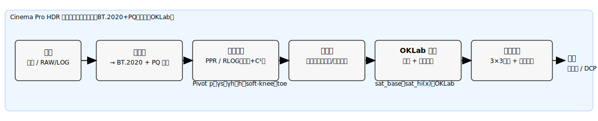
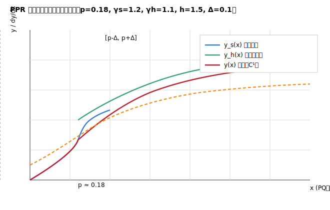
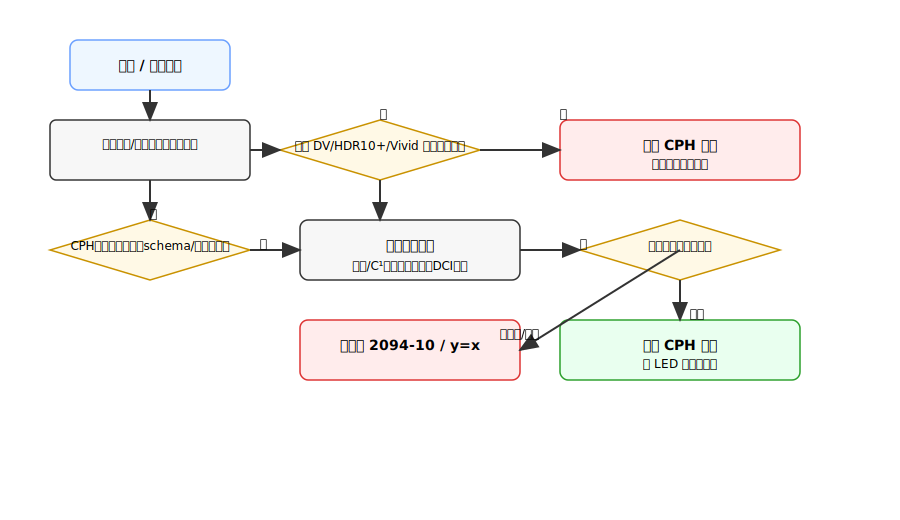
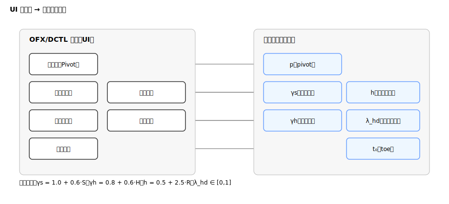

# Cinema Pro HDR v0.2 发明技术披露书

## 目录

* [1. 技术领域与背景](#1-技术领域与背景)
* [2. 发明目的与技术问题](#2-发明目的与技术问题)
* [3. 符号约定与工作域](#3-符号约定与工作域)
* [4. 核心技术方案](#4-核心技术方案)

  * [4.1 CPH-PPR（默认曲线）](#41-cph-ppr默认曲线)
  * [4.2 CPH-RLOG（备选曲线）](#42-cph-rlog备选曲线)
  * [4.3 软膝与黑位 toe（防炸峰/发灰）](#43-软膝与黑位-toe防炸峰发灰)
  * [4.4 OKLab 分层饱和与两级色域回扣](#44-oklab-分层饱和与两级色域回扣)
  * [4.5 回退状态机（兼容/安全执行）](#45-回退状态机兼容安全执行)
* [5. 元数据与封装（基础层 + 扩展层）](#5-元数据与封装基础层--扩展层)
* [6. 实施例与工程实现要点](#6-实施例与工程实现要点)
* [7. 技术效果与可验证指标（有益效果）](#7-技术效果与可验证指标有益效果)
* [8. 与现有技术对比（新颖性/创造性要点）](#8-与现有技术对比新颖性创造性要点)
* [9. 权利要求书草案要点（供代理取材）](#9-权利要求书草案要点供代理取材)
* [10. 附图清单与出图说明](#10-附图清单与出图说明)
* [11. 名词表与默认参数](#11-名词表与默认参数)
* [12. 文档与交付物命名建议](#12-文档与交付物命名建议)

---

## 1. 技术领域与背景

本发明涉及**电影级 HDR（高动态范围）色调映射与色彩管理**，尤其是一种**兼容 ST 2094-10 基础层**、并通过**原创解析曲线（PPR/RLOG）+ 分层细节/饱和**实现创作意图可控与放映端可适配的动态映射方法、装置、存储介质及其元数据封装。

**痛点**：

* 既有生态（Dolby Vision/HDR10+/HDR Vivid）在影院/放映端的可用性、兼容性与授权复杂度不一；
* 传统 Sigmoid/Bezier/样条式映射在**参数可解释性、单调性/C¹ 保障、闪烁抑制**方面存在工程隐患；
* **导演意图**跨终端复现缺乏**参数化/可审计**的基线与扩展机制。

---

## 2. 发明目的与技术问题

**目的**：在**不破坏现有生态**的前提下，提供一种**基础层完全兼容 ST 2094-10**、扩展层**采用原创曲线族（PPR/RLOG）**并具有**分层细节增强与感知饱和控制**的动态映射方案；在**设备不支持/风险检测**时自动**回退**，在**支持**时实现**创作意图的参数化还原与设备适配**。

**解决的问题**：

1. **曲线可解释**与**创作参数 → 数学参数**的一一对应；
2. **单调 + C¹** 可证明与可检测，降低条带/闪烁；
3. **高光细节**与**OKLab 分层饱和**的稳定增强；
4. **双层元数据**（2094-10 基础 + CPH 扩展）与**回退状态机**，避免二次映射；
5. **DCI 合规**与**色域越界**的工程化检查与报告能力。

---

## 3. 符号约定与工作域

* **输入亮度标量**：$x \in [0,1]$（**PQ 归一域**；ST 2084 归一后 0=黑，1=峰值）。
* **输出亮度标量**：$y \in [0,1]$（同域）。
* **中灰枢轴**：$p \in (0,1)$，建议默认 $p \approx \mathrm{PQ}(0.18)$。
* **典型参数域**：

  * $\gamma_s \in [1.0,1.6]$（暗部幂指数）
  * $\gamma_h \in [0.8,1.4]$（高光幂指数）
  * $h \in [0.5,3.0]$（高光肩部压缩）
  * $k = 1.0$（增益，常数）
* **C¹ 平滑窗**（用于段间混合）：

  $$
  \mathrm{smoothstep}(a,b,x)=t^2(3-2t),\quad t=\mathrm{clamp}\left(\frac{x-a}{b-a},0,1\right)
  $$

---

## 4. 核心技术方案

### 4.1 CPH-PPR（默认曲线）

**思想**：以中灰枢轴为支点，暗部用幂型控制对比，高光用有理式自然收肩，采用 C¹ 平滑窗在枢轴邻域混合，整体**单调**且**C¹ 连续**。

**分段与混合：**

* 暗部幂段（$x \le p$）：
  $$
  y_s(x)=p\cdot\left(\frac{x}{p}\right)^{\gamma_s}
  $$
* 高光有理段（$x \ge p$）：
  $$
  y_h(x)=\left(\frac{kx}{1+hx}\right)^{\gamma_h}
  $$
* 过渡权重（中心 $p$，半宽 $\Delta\approx0.1$）：
  $$
  w(x)=\mathrm{smoothstep}(p-\Delta,p+\Delta,x)
  $$
* 全域输出：
  $$
  y(x)=(1-w)y_s+wy_h
  $$

**单调性（充分条件）**：

* 暗部导数：
  $$
  \frac{d y_s}{dx}=\gamma_s p^{1-\gamma_s} x^{\gamma_s-1}\ge0 \Rightarrow \gamma_s \ge 0
  $$
* 高光导数：
  $$
  \frac{d}{dx}\left(\frac{kx}{1+hx}\right)=\frac{k}{(1+hx)^2}>0
  $$

  进而 $y_h(\cdot)^{\gamma_h}$ 保单调（$\gamma_h>0$）。
* 因 $0\le w\le1$ 且 $w$ 单调增，左右段各自单调时，混合亦单调（工程上以**4096 采样**验证）。

**C¹ 连续性（实操验证准则）**：在 $p\pm \epsilon$ 进行左右差分导数估计，阈值 $<10^{-3}$ 判定通过。

---

### 4.2 CPH-RLOG（备选曲线）

**思想**：暗部采用**对数**以提升低亮度控制，高光采用**有理式**稳态压肩，在阈值 $t$ 邻域以 C¹ 平滑窗拼接。

* 暗部对数段：
  $$
  y_s(x)=\frac{\ln(1+ax)}{\ln(1+a)},\quad a>0
  $$
* 高光有理段：
  $$
  y_h(x)=\frac{bx}{1+cx},\quad b>0,c>0
  $$
* 阈值拼接（宽度 $\delta\approx0.05$）：
  $$
  w(x)=\mathrm{smoothstep}(t-\delta,t+\delta,x),\quad y=(1-w)y_s+wy_h
  $$

**单调性**：

$$
\frac{d y_s}{dx}=\frac{a}{(1+a)\ln(1+a)}\cdot\frac{1}{1+ax}>0,\quad
\frac{d y_h}{dx}=\frac{b}{(1+cx)^2}>0
$$

---

### 4.3 软膝与黑位 toe（防炸峰/发灰）

* **软膝（Soft-Knee）**：
  $$
  y_{\mathrm{knee}} = y - \alpha \cdot \mathrm{smoothstep}(y_k,1,y)\cdot (y- y_k),\quad y_k\in[0.95,0.99], \alpha\in[0.2,1.0]
  $$
* **黑位 toe**：
  $$
  y_{\mathrm{toe}} = \max\left(0, y_{\mathrm{knee}}-t_0\right),\quad t_0\in[0,0.01]
  $$

  两者均为 C¹ 可微且保持单调。

---

### 4.4 OKLab 分层饱和与两级色域回扣

**流程**：线性 RGB → XYZ（标准矩阵）→ OKLab。

* **全局饱和**：$(a,b)\leftarrow s_{\mathrm{base}}\cdot(a,b), s_{\mathrm{base}}\in[0,2]$
* **亮区饱和**：$(a,b)\leftarrow s_{\mathrm{hi}}(x)\cdot(a,b)$，其中
  $$
  s_{\mathrm{hi}}(x)=1+(s_{\mathrm{hi}}-1)\cdot \mathrm{smoothstep}(p,1,x)
  $$

**回到 RGB 后执行两级色域回扣**：

1. **一级线性压制**（3×3 映射至目标原色三角形）：

   $$
   \mathbf{RGB}_{\mathrm{clamp}}=\mathrm{clip}\left(\mathbf{M}_{\mathrm{src}\rightarrow\mathrm{dst}}\cdot \mathbf{RGB},0,1\right)
   $$
2. **二级感知夹持**（OKLab 半径缩放）：

   * 令 $(L,a,b)=\mathrm{OKLab}(\mathbf{RGB}_{\mathrm{clamp}})$，色度半径 $C=\sqrt{a^2+b^2}$
   * 若超出上界 $C_{\max}(L)$，缩放：
     $$
     s=\min\left(1,\frac{C_{\max}(L)}{C+\epsilon}\right),\quad (a,b)\leftarrow s\cdot(a,b)
     $$
   * 逆变换至 RGB。记录**越界占比**与**worst-10** 样本坐标。

---

### 4.5 回退状态机（兼容/安全执行）

**核心原则**：**检测到他家动态映射或任何不确定风险 → 禁用扩展/回退**，绝不二次映射。

```text
if Detect(DV | HDR10+ | Vivid active) -> DISABLE(CPH_exec)         // 禁止叠加
else if !Support(CPH_ext) or SidecarMissing or SchemaError -> USE(ST2094-10_baseline)
else if !Monotonic || !C1 || Flicker>th || Perf>budget || DCI_fail -> DEGRADE_or_FALLBACK()
else -> ENABLE(CPH_exec_with_LED_adaptation)
```

* **ENABLE**时允许**LED 自适配**（按峰值/黑位微调 shoulder/black_lift/sat_hi），仍保证单调+C¹。
* **FALLBACK**路径：仅基础层（2094-10）或 `y=x` 硬回退（异常时）。

---

## 5. 元数据与封装（基础层 + 扩展层）

**基础层**：**ST 2094-10** 常用统计与显示目标参数（可被现有生态读取）。
**扩展层**：**CPH 参数块**（版本、曲线类型与参数、工作域、时间码/GUID 等）。

**侧车 JSON 示例（可等效封装至 SEI 或 ISOBMFF 私有 box）**：

```json
{
  "$schema": "https://json-schema.org/draft/2020-12/schema",
  "st2094_10": {
    "minPqEncodedMaxRGB": 12,
    "avgPqEncodedMaxRGB": 280,
    "maxPqEncodedMaxRGB": 900
  },
  "cph_meta": {
    "cph_version": 2,
    "cph_curve_id": 0,                // 0=PPR, 1=RLOG
    "pivot": 0.18,
    "gamma_s": 1.25,
    "gamma_h": 1.10,
    "shoulder": 1.5,
    "black_lift": 0.005,
    "highlight_detail": 0.6,
    "sat_base": 1.0,
    "sat_hi": 0.95,
    "work_cs": "BT2020_PQ",
    "hash_clip_guid": "uuid-v4",
    "timecode_inout": "01:00:00:00-01:00:12:12"
  }
}
```

**版本与回退**：`cph_version` 不被识别或字段越界 → 记录错误码并回退基础层。

---

## 6. 实施例与工程实现要点

* **GPU 实现**：逐像素 O(1)，用权重混合替代分支；FP16 计算 + FP32 累加；确定性模式下禁用 FMA 合并（编译开关记录）。
* **导数开销**（便于优化）：
  $$
  \frac{d}{dx}\left(\frac{kx}{1+hx}\right)^{\gamma_h}=\gamma_h\left(\frac{kx}{1+hx}\right)^{\gamma_h-1}\cdot \frac{k}{(1+hx)^2}
  $$
* **统计与频域分析**：实时计算 min/avg/max PqMaxRGB；闪烁检测（1–6Hz）可异步执行或离线验证。
* **DCI 合规模式**：P3-D65 限域，白点≈300 nits、黑位≈0.005 nits、EOTF=PQ 信令检查；超界自动保守化或回退。

---

## 7. 技术效果与可验证指标（有益效果）

> 以下指标作为**验收口径**与**可审计证据**（SLA）。

1. **单调 & C¹ 连续性**

   * 4096 均匀采样 + 枢轴邻域 256 重点点；左右差分导数阈值 **< 1e-3**。
2. **亮度/EOTF 跟踪**

   * PQ 归一域 $0.01\to0.98$：**RMS ≤ 5%**、**最大 ≤ 10%**；
   * 软膝后**过曝像素占比 ≤ 0.5%**。
3. **色差（LUT 近似）**

   * **P3-D65**：**ΔE00** 均值 ≤ **0.5**；**P99 ≤ 1.0**；**最大 ≤ 2.0**（输出 **worst-10** 样本）。
4. **抗闪烁（时间稳定）**

   * 帧差 RMS：不高于参考流程 110%；
   * **1–6 Hz** 频段能量开启细节后**不得上升 > 20%**。
5. **性能**

   * **4K24 < 1.0 ms/帧**、**8K24 < 3.5 ms/帧**；统计方法：预热 100 帧，计 3000 帧，取**中位/P95**。
6. **色域与合规**

   * 越界占比 **≤ 0.2%**；列举 worst-10；
   * **DCI 模式**：白点/黑位与 EOTF 信令通过；失败非 0 退出码并输出定位报告。

---

## 8. 与现有技术对比（新颖性/创造性要点）

1. **曲线构型差异**

   * 本发明采用**幂 + 有理/对数 + C¹ 平滑窗**的解析组合（PPR/RLOG），区别于 Sigmoid（ST 2094-10）、Bezier（HDR10+）、分段样条（Vivid）。
2. **C¹ 与单调可证性**

   * 提供导数解析式与**工程级验证准则**（4096 采样 + 枢轴邻域差分），降低条带/闪烁风险，优于统计生成式曲线的不确定性。
3. **分层饱和 + 两级回扣**

   * 在 **OKLab** 实施**亮区独立饱和控制**与**半径夹持**，结合**3×3 线性压制**，兼顾“电影味道”与影院色容积边界。
4. **双层元数据 + 回退状态机**

   * 基础层**完全兼容 2094-10**；扩展层参数化且**遇到 DV/HDR10+/Vivid 或异常自动回退**，避免二次色调映射，工程可用性强。
5. **DCI 合规工具化**

   * 将白点/黑位/EOTF/色域边界检查**工具化与报告化**，增强可审查/可追溯能力。

---

## 9. 权利要求书草案要点

**独立权 1（方法）**
一种电影 HDR 动态映射方法，包括：

* 在 PQ 归一域对输入亮度 $x$ 进行映射；
* 基于**枢轴幂段**与**高光有理段**构造目标曲线，并在枢轴邻域以 C¹ 平滑窗混合得到输出 $y$，所述输出满足单调与 C¹ 连续；
* 在输出端对 $y$ 施加**软膝**与**黑位 toe**；
* 在 **OKLab 域**执行**分层饱和度调制**并实施**两级色域回扣**；
* 通过**双层元数据**（ST 2094-10 基础层与扩展层参数）进行传输与回退控制，其中回退状态机在检测到外部动态映射激活、参数越界、单调/C¹ 失败、闪烁/性能/合规失败时禁用扩展或回退。

**独立权 2（装置/系统）**
……（包含处理器、存储器与接口；内置回退状态机与参数适配模块）

**独立权 3（存储介质）**
……（存储可执行程序，执行权 1 所述方法步骤）

**从属权要点（可选）**

* PPR/RLOG 具体数学式与参数域；
* 平滑窗采用 `smoothstep`；
* DCI 合规模式（P3-D65 限域 + 软膝/toe 策略）；
* 侧车 JSON 字段/版本与 SEI/私有 box 等等效承载；
* 详细回退条件集合与优先级。

---

## 10. 附图清单与出图说明

> **建议统一坐标 0–1，标注默认参数与关键点（p、Δ、t、δ、y_k、α、t_0）**。流程图用菱形判定节点与回退终端。

1. **fig01_system_pipeline.svg** —— 系统框图：输入 → BT.2020+PQ → 曲线（PPR/RLOG）→ 细节层 → OKLab 饱和 → 色域回扣 → 输出。



2. **fig02_ppr_curve_and_derivative.svg** —— PPR 的 $(y_s,y_h,y)$ 与 $\frac{dy}{dx}$；标注 $(p,\Delta)$。


3. **fig03_rlog_blend.svg** —— RLOG 在 $t\pm\delta$ 的权重曲线与两段曲线拼接示意。


4. **fig04_fallback_state_machine.svg** —— 回退/启用判定流程：检测 DV/HDR10+/Vivid、schema、单调/C¹、闪烁/性能/合规门。


5. **fig05_oklab_saturation_and_gamut_clamp.svg** —— OKLab 分层饱和与半径夹持（C–L 平面）示意。


6. **fig06_dci_compliance_tracking.svg** —— DCI 模式白点/黑位与 EOTF 跟踪容差带示意。


7. **fig07_ui_knob_mapping.svg** —— “五旋钮 → 参数”映射关系图：Pivot、Shadows/Highlight、Roll-off、Detail、Black Lift → (p,\gamma_s,\gamma_h,h,\lambda_{hd},t_0)。



---

## 11. 名词表与默认参数

* **PPR**：Pivoted Power–Rational；**RLOG**：Rational–Logarithmic
* **Pivot (p)**：默认 $\approx \mathrm{PQ}(0.18)$
* **参数推荐域**：

  * $\gamma_s \in [1.0,1.6], \gamma_h \in [0.8,1.4], h \in [0.5,3.0]$
  * 软膝：$y_k \in [0.95,0.99], \alpha \in [0.2,1.0]$
  * toe：$t_0 \in [0,0.01]$
  * RLOG：$a \in [1,16], b \in [0.8,1.2], c \in [0.5,3.0], t \in [0.4,0.7], \delta \approx 0.05$

---

## 12. 文档与交付物命名建议

* **披露书主文档**：`Cinema_Pro_HDR_发明技术披露书.md`
* **附图目录**：`fig01_system_pipeline.svg ... fig07_ui_knob_mapping.svg`
* **数学附录**（可转 PDF 提交）：`CPH_v0.2_MathAppendix.md`（含导数与证明细节）
* **Schema**：`cph.schema.json`（与产品线一致，版本常量 cph_version=2）

---

### 附：侧车 JSON Schema 片段

```json
{
  "$id": "https://example.com/cph.schema.json",
  "$schema": "https://json-schema.org/draft/2020-12/schema",
  "title": "Cinema Pro HDR Sidecar",
  "type": "object",
  "required": ["st2094_10", "cph_meta"],
  "properties": {
    "st2094_10": {
      "type": "object",
      "required": ["minPqEncodedMaxRGB","avgPqEncodedMaxRGB","maxPqEncodedMaxRGB"],
      "properties": {
        "minPqEncodedMaxRGB": {"type":"number","minimum":0,"maximum":10000},
        "avgPqEncodedMaxRGB": {"type":"number","minimum":0,"maximum":10000},
        "maxPqEncodedMaxRGB": {"type":"number","minimum":0,"maximum":10000}
      },
      "additionalProperties": false
    },
    "cph_meta": {
      "type": "object",
      "required": ["cph_version","cph_curve_id","pivot","work_cs"],
      "properties": {
        "cph_version": {"type":"integer","minimum":2,"maximum":2},
        "cph_curve_id": {"type":"integer","enum":[0,1]},
        "pivot": {"type":"number","minimum":0.05,"maximum":0.30},
        "gamma_s": {"type":"number","minimum":1.0,"maximum":1.6},
        "gamma_h": {"type":"number","minimum":0.8,"maximum":1.4},
        "shoulder": {"type":"number","minimum":0.5,"maximum":3.0},
        "black_lift": {"type":"number","minimum":0.0,"maximum":0.02},
        "highlight_detail": {"type":"number","minimum":0.0,"maximum":1.0},
        "sat_base": {"type":"number","minimum":0.0,"maximum":2.0},
        "sat_hi": {"type":"number","minimum":0.0,"maximum":2.0},
        "work_cs": {"type":"string","enum":["BT2020_PQ"]},
        "hash_clip_guid": {"type":"string","format":"uuid"},
        "timecode_inout": {
          "type":"string",
          "pattern":"^[0-2][0-9]:[0-5][0-9]:[0-5][0-9]:[0-5][0-9]-[0-2][0-9]:[0-5][0-9]:[0-5][0-9]:[0-5][0-9]$"
        },
        "generator": {"type":"string"}
      },
      "additionalProperties": false
    }
  },
  "additionalProperties": false
}
```
